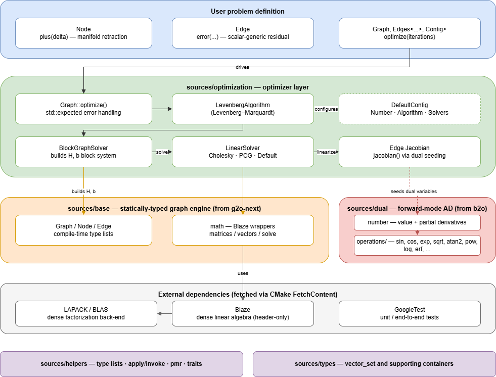

# Vortex

**A header-only C++23 graph-optimization library with exact, automatically
differentiated Jacobians.**

Vortex (build target `vortex`) is a compile-time, type-safe non-linear
least-squares optimizer for graph/factor-graph problems such as SLAM, bundle
adjustment and sensor calibration. It combines two ideas:

- the **graph optimization engine** of `vortex` — a modern, allocation-aware,
  statically-typed rewrite of the classic
  [g2o](https://github.com/RainerKuemmerle/g2o) framework, and
- the **forward-mode automatic differentiation** (dual numbers) of `b2o` — so
  that edge Jacobians are computed *exactly* from a single scalar-generic
  `error()` function instead of being derived and hand-coded.

The result: you write your residual once, and the exact Jacobian comes for free.

---

## Highlights

- **Write the cost once.** A derived edge implements a single templated
  `error(...)`. It is evaluated with `double` to get the residual and with a
  dual number to get the exact Jacobian — no numerical differentiation, no
  hand-written derivatives.
- **Statically typed graph.** Node and edge types, their dimensions, and their
  connectivity are all part of the type system, checked at compile time.
- **Allocation-aware.** Built on `std::pmr` memory resources (monotonic + pool
  + bounded) for predictable, low-overhead allocation.
- **Pluggable solver stack.** Levenberg–Marquardt algorithm, block graph
  solver, and Cholesky / PCG / dense linear back-ends selected through a single
  configuration struct.
- **Modern C++23.** Uses `std::expected` for error handling, concepts, and
  `std::pmr`.
- **Header-only core** with a thin static-library shim; [Blaze](https://bitbucket.org/blaze-lib/blaze)
  provides the dense linear algebra (backed by LAPACK/BLAS).

---

## Architecture



### Source layout

| Path | Responsibility |
| --- | --- |
| [sources/dual/](sources/dual/) | Dual-number type (`number<T>`) and math operations for forward-mode automatic differentiation (ported from `b2o`). |
| [sources/base/](sources/base/) | Core statically-typed graph engine — `Graph`, `Node`, `Edge`, revision tracking, memory management, and math wrappers (from `vortex`). |
| [sources/optimization/](sources/optimization/) | Optimizer layer: `optimize()`, Levenberg–Marquardt algorithm, block graph solver, and the Cholesky/PCG/default linear solvers. Edges compute exact Jacobians via dual numbers. |
| [sources/helpers/](sources/helpers/) | Compile-time utilities — type lists, apply/invoke, shared/pmr helpers, traits. |
| [sources/types/](sources/types/) | Small supporting containers (e.g. `vector_set`). |
| [tests/](tests/) | GoogleTest unit and end-to-end tests, including a scalar-generic SLAM fixture. |

---

## How automatic differentiation works

Each derived edge implements **one** scalar-generic residual function:

```cpp
struct PoseDistance : go::Edge<PoseDistance, 2, Pointd, go::Nodes<Pose, Pose>> {
  using Base::Base;

  template <class T>
  auto error(const Point2<T>& a, const Point2<T>& b) -> Base::Error<T> {
    return {(b.x - a.x) - this->measurement().x,
            (b.y - a.y) - this->measurement().y};
  }
};
```

- Evaluated with `T = double` → the **residual** used to compute `chi²`.
- Evaluated with `T = number<double>` → the residual carries its **exact
  partial derivatives**. The optimizer seeds one node's tangent increment with
  independent dual variables and reads the Jacobian directly from the dual
  residual (see `Edge::jacobian()` in [sources/optimization/graph_edge.hpp](sources/optimization/graph_edge.hpp)).

No finite differences, no manually maintained Jacobian blocks.

---

## Getting started

### Prerequisites

- A **C++23** compiler (GCC 13+ / Clang 17+).
- **CMake ≥ 3.24**.
- **LAPACK** and **BLAS** development libraries (used by the Blaze dense
  solvers). On Debian/Ubuntu:

  ```bash
  sudo apt-get install liblapack-dev libblas-dev
  ```

Blaze and GoogleTest are fetched automatically via CMake `FetchContent`.

### Build & test

```bash
cmake -S . -B build -DCMAKE_BUILD_TYPE=Release
cmake --build build -j
ctest --test-dir build --output-on-failure
```

To build the library without tests:

```bash
cmake -S . -B build -DVORTEX_BUILD_TESTS=OFF
cmake --build build -j
```

### Use it in your project

The library exports the target `vortex::vortex`:

```cmake
add_subdirectory(vortex)          # or FetchContent
target_link_libraries(my_app PRIVATE vortex::vortex)
```

```cpp
#include "vortex.hpp"   // pulls in graph::optimization
```

---

## Minimal example

A tiny 2D pose-graph SLAM problem: three poses, one prior, two relative
constraints. Full code lives in
[tests/fixtures/simple_slam_problem.hpp](tests/fixtures/simple_slam_problem.hpp)
and [tests/optimization_test.cpp](tests/optimization_test.cpp).

```cpp
#include <memory_resource>
#include "tests/fixtures/simple_slam_problem.hpp"

using namespace vortex::test;

SlamGraph g{std::pmr::new_delete_resource()};

// Vertices (poses) and factors (edges)
auto p1 = g.build<Pose>(SlamGraph::Key{1});
auto p2 = g.build<Pose>(SlamGraph::Key{2});
auto p3 = g.build<Pose>(SlamGraph::Key{3});
auto d1 = g.build<PoseDistance>(**p1, **p2);
auto d2 = g.build<PoseDistance>(**p2, **p3);
auto l1 = g.build<PoseLocation>(**p1);

// Initial estimates + measurements
(*p1)->estimation(Pointd{0, 0});
(*p2)->estimation(Pointd{2, 2});
(*p3)->estimation(Pointd{0, 0});
(*l1)->measurement(Pointd{1, 1});   // prior:      p1 = (1,1)
(*d1)->measurement(Pointd{1, 1});   // relative:   p2 - p1 = (1,1)
(*d2)->measurement(Pointd{0, 0});   // relative:   p3 - p2 = (0,0)

// Optimize (Levenberg–Marquardt); returns std::expected<size_t, AlgorithmError>
const auto result = g.optimize(/*iterations=*/10);
if (result) {
  // Converges to p1=(1,1), p2=(2,2), p3=(2,2)
}
```

### Defining your own problem

1. **Node** — subclass `go::Node<Derived, Dim, EstimationType, go::Edges<...>>`
   and implement a scalar-generic `plus(delta)` manifold retraction.
2. **Edge** — subclass `go::Edge<Derived, Dim, MeasurementType, go::Nodes<...>>`
   and implement a scalar-generic `error(...)` returning `Base::Error<T>`.
3. **Graph** — subclass `go::Graph<go::Nodes<...>, go::Edges<...>>`.
4. Build nodes/edges, set estimations & measurements, call `optimize()`.

---

## Configuration

Solver behaviour is selected through a configuration struct (see
[sources/optimization/graph_config.hpp](sources/optimization/graph_config.hpp)).
The defaults are:

| Component | Default |
| --- | --- |
| Scalar `Number` | `double` |
| Algorithm | `LevenbergAlgorithm` |
| Graph solver | `BlockGraphSolver` |
| Linear solver | `DefaultLinearSolver` (also available: `Cholesky`, `PCG`) |
| `SystemCapacity` | `0x200` |

Provide your own struct deriving from `graph::optimization::DefaultConfig` and
pass it as the third template parameter of `go::Graph` to swap any of these.

---

## Testing

```bash
ctest --test-dir build --output-on-failure
```

- [tests/dual_test.cpp](tests/dual_test.cpp) — verifies AD rules (product,
  quotient, trig, `atan2`, chain rule) and checks the Jacobian against central
  differences.
- [tests/optimization_test.cpp](tests/optimization_test.cpp) — end-to-end
  optimization that exercises the dual-number Jacobians on the SLAM fixture.

---

## Acknowledgements
- **[Blaze](https://bitbucket.org/blaze-lib/blaze)** — high-performance C++
  dense linear algebra.
- **[GoogleTest](https://github.com/google/googletest)** — unit testing.